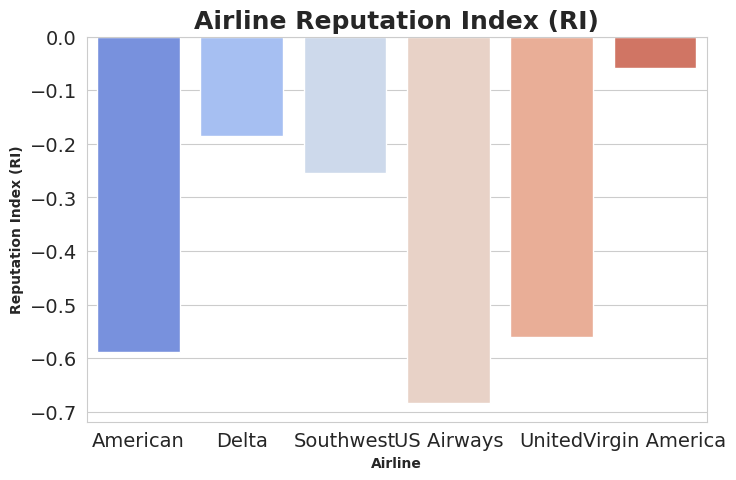

# Airline Sentiment Analysis (NLP · WordCloud · ML)

This repository contains an end-to-end analysis of airline customer tweets using Natural Language Processing (NLP) and Machine Learning.  
The project cleans and preprocesses raw text, builds a sentiment classification model, and visualizes insights using plots and word clouds.

Main notebook:  
`Airline_Review_Sentimental_Analysis_(NLP)_&_Visulalization_in_Wordcloud.ipynb`

---

## 1. Project Overview

Airlines receive huge volumes of customer feedback on social media.  
The goal of this project is to:

- Classify each tweet into emotions such as **anger**, **joy**, and **neutral**.
- Compare emotions across airlines using visual analytics.
- Build a simple but effective ML model for sentiment/emotion prediction.
- Generate **WordClouds** to highlight common terms in negative and positive tweets.

This analysis can help airlines understand pain points, service issues, and customer satisfaction trends.

---

## 2. Model Architecture

### 2.1 High-Level Pipeline


```
Raw Tweets
   ↓
Text Preprocessing
   ↓
TF-IDF Feature Extraction
   ↓
Machine Learning Classifier
   ↓
Predicted Emotion (anger / joy / neutral)
```


## 🔥 Key Features

- Text preprocessing (tokenization, stopword removal, stemming/lemmatization)
- Sentiment classification using ML models
- WordClouds for positive and negative feedback
- Sentiment distribution & data visualization
- Clean, structured Jupyter notebook for reproducible results

---

## 📂 Repository Structure
```
Airline-Sentiment-Analysis_23/
│── Airline_Review_Sentimental_Analysis_(NLP)_&_Visulalization_in_Wordcloud.ipynb
│──images
│── README.md (you are here)
└── data
```      


---

## 📊 Dataset Details

| Attribute | Info |
|----------|------|
| Source   | Kaggle |
| Format   | CSV |
| Fields   | review_text, airline, sentiment_label, etc |
| Size     | ~14,640 rows|

> dataset source link.
https://www.kaggle.com/datasets/tango911/airline-sentiment-tweets
---

## 🧠 ML/NLP Workflow

1. Load and inspect dataset  
2. Preprocess text (cleaning + normalization)  
3. Encode sentiment labels  
4. Perform EDA (sentiment counts, word frequency, barplots)  
5. Create WordClouds per sentiment class  
6. Convert text into TF-IDF / Bag-of-Words vectors  
7. Train ML models (Naive Bayes / Logistic Regression / SVM etc.)  
8. Evaluate using accuracy & confusion matrix  

---

## 🏗 Technologies Used

| Tech | Purpose |
|------|----------|
| Python | Core programming |
| Pandas, NumPy | Data handling |
| Scikit-Learn | Machine learning models |
| NLTK / SpaCy | NLP preprocessing |
| Matplotlib, Seaborn | Visualizations |
| WordCloud | Text visualization |
| Google Colab / Jupyter | Notebook execution |

---

## Install dependencies:

pip install pandas numpy scikit-learn nltk seaborn matplotlib wordcloud

## Run notebook:
jupyter notebook
open the .ipynb file and run cell-by-cell

## Visulization Plots:



## 🚀 How to Run Locally

Clone the repository:

```bash
git clone https://github.com/<your-username>/Airline-Sentiment-Analysis_23.git
cd Airline-Sentiment-Analysis_23

